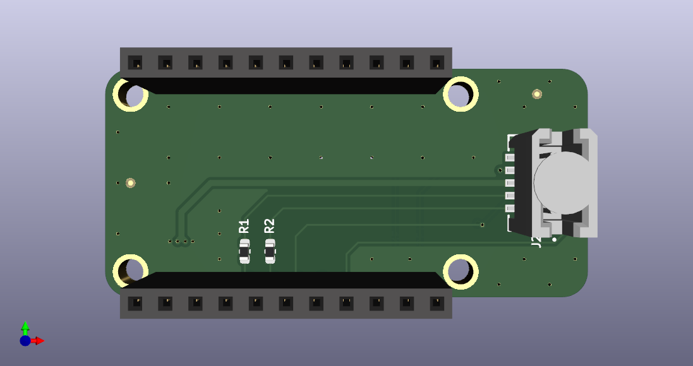

# hw-ignition-adapter

Programming Adapter for using [Adafruit FT232H](https://www.adafruit.com/product/2264)
compatible with iceprog and the Samtec debug pinout we're using on our designs.

We have typically built this by soldering the strip headers
included with the adafruit dongle upside-down on the
Adafruit adaptor and then soldered into this board making a purpose-built unit (skipping installation of separate receptacles on this board as are rendered below).  If doing so, using some spare
header strips to space the two boards apart has been helpful
for then allowing probes to connect to the pins.

# Status
CAD has been built and works as designed.
